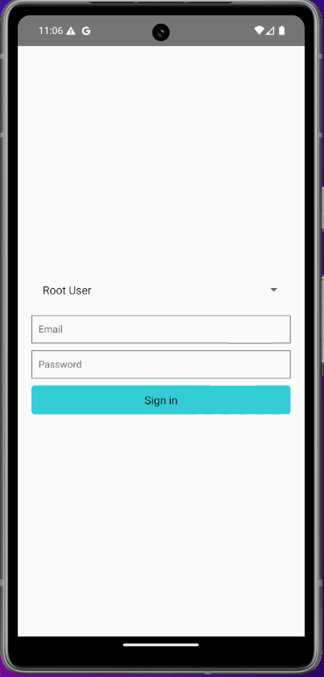
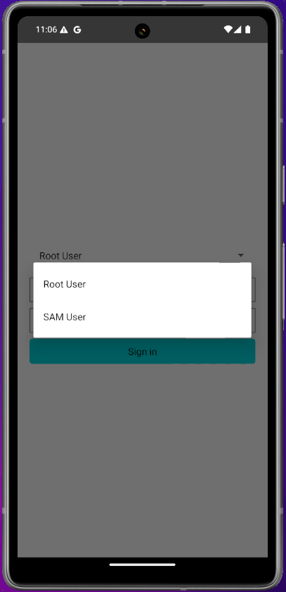
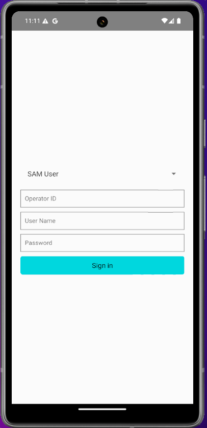
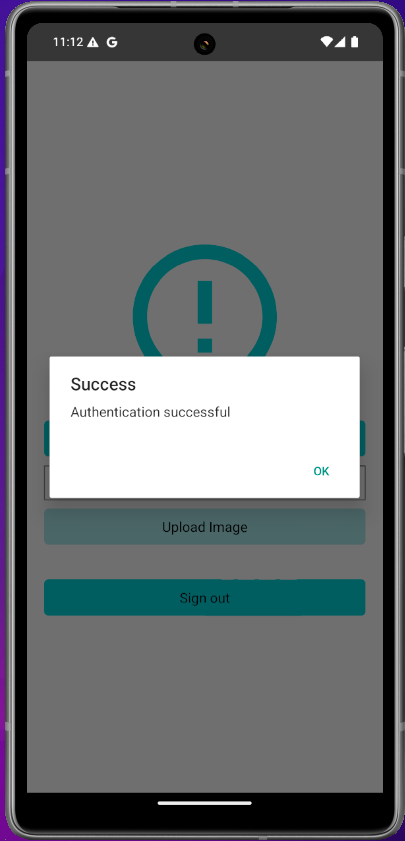
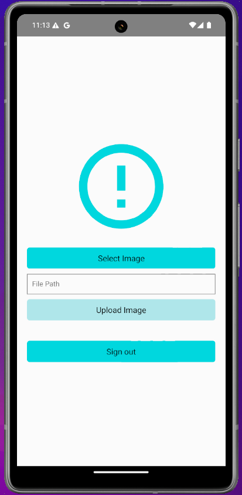
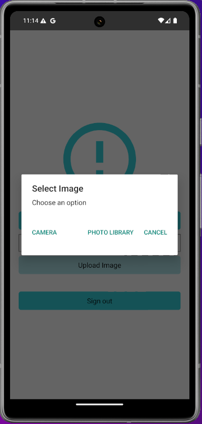
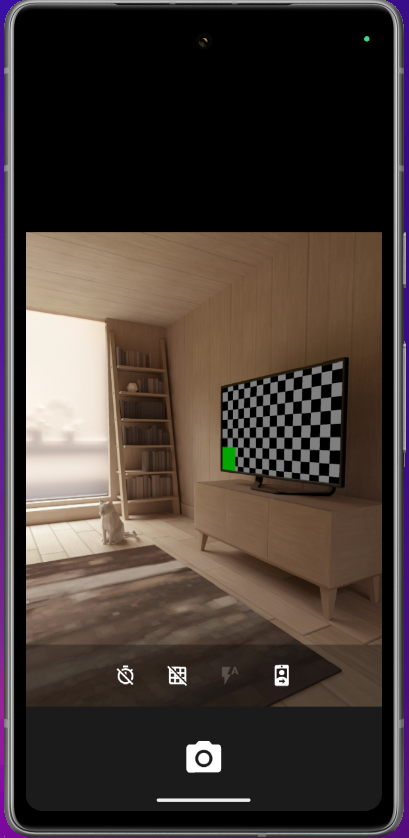
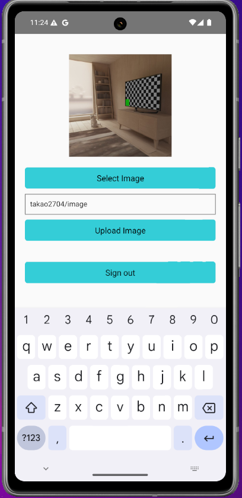
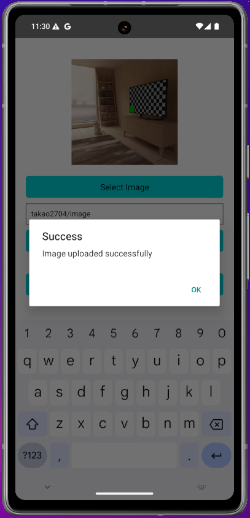
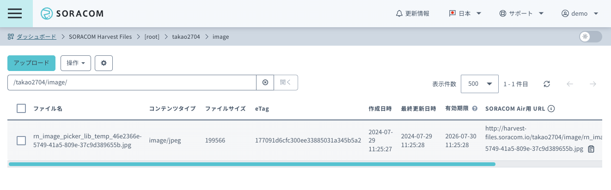

# ImageSender
ImageSender is a React Native app designed to upload images from smartphones to SORACOM Harvest Files. This app supports authentication for both root users and SAM users, allowing images to be selected and uploaded from the camera or photo library.

## Features

- Authentication for root and SAM users
- Image selection from camera or photo library
- Upload images to SORACOM Harvest Files
- Manage authentication information and log out

## Environment Setup

### Prerequisites

- Node.js
- npm or yarn
- Xcode (for iOS development)
- Android Studio (for Android development)

### Clone the Repository

```bash
git clone https://github.com/your-username/ImageSender.git
cd ImageSender
```

### Install Dependencies
```bash
yarn install
# or
npm install
```

### iOS　Setup
1. Install CocoaPods:

```bash
cd ios
pod install
cd ..
```

2. Add the following permissions to Info.plist:
```xml
<key>NSCameraUsageDescription</key>
<string>We need access to your camera to take pictures.</string>
<key>NSPhotoLibraryUsageDescription</key>
<string>We need access to your photo library to select pictures.</string>
<key>NSPhotoLibraryAddUsageDescription</key>
<string>We need access to your photo library to save pictures.</string>
```

### Android Setup
1. Add the following permissions to AndroidManifest.xml:

```xml
<uses-permission android:name="android.permission.CAMERA" />
<uses-permission android:name="android.permission.WRITE_EXTERNAL_STORAGE" />
<uses-permission android:name="android.permission.READ_EXTERNAL_STORAGE" />
```

2. Create a Keystore (for release build)
```bash
keytool -genkey -v -keystore my-release-key.jks -keyalg RSA -keysize 2048 -validity 10000 -alias my-key-alias
```

3. Configure gradle.properties
Create a gradle.properties file in the root directory of the project and add the following:
```properties
MYAPP_RELEASE_STORE_FILE=my-release-key.jks
MYAPP_RELEASE_KEY_ALIAS=my-key-alias
MYAPP_RELEASE_STORE_PASSWORD=your_store_password
MYAPP_RELEASE_KEY_PASSWORD=your_key_password
```

## Running in Development
### iOS
```bash
npx react-native run-ios
```
### Android
```bash
npx react-native run-android
```

## Building
### Build for iOS
Open Xcode and load ImageSender.xcworkspace. Then select your build target and build the project.

### Build for Android
```bash
cd android
./gradlew assembleRelease
```

## Usage
1. Launch the app and enter your authentication information to sign in.





2. Upon successful authentication, proceed to the image selection screen.




3. Press the Select Image button to choose an image from the camera or photo library.




4. Enter the file path for the upload destination and press the Upload Image button to upload the image.





5. Press the Sign out button to log out if needed.

